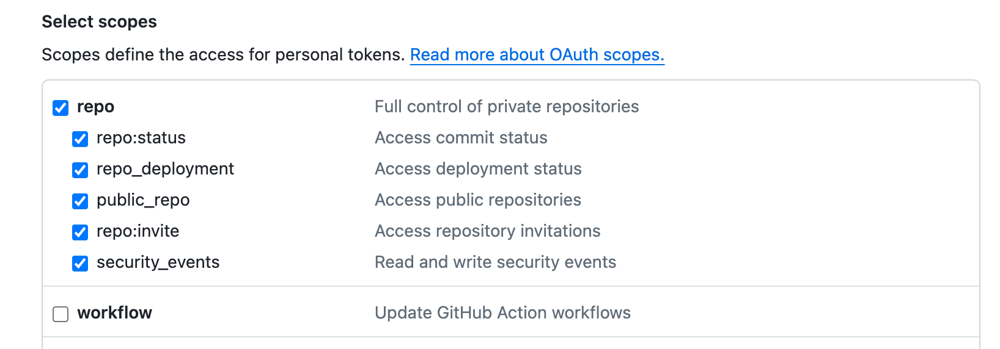

# NPI

> [!WARNING]
> NPi is currently under active development and the APIs are subject to change in the future release. It is recommended
> to use the command line tool to try it out.

NPi is an open-source platform providing **_Tool-use_** APIs to empower AI agents with the ability to take action in virtual world!

[🛠️Try NPi Online](https://try.npi.ai): Try NPi on online Playground

[👀 NPi Example](https://www.npi.ai/docs/examples?utm_source=github&utm_campaign=readme): **Highly recommended to check this first** - See what you can build with NPi.

[🔥 Introducing NPi](https://www.npi.ai/blog/introducing-npi?utm_source=github&utm_campaign=readme): Why we build NPi?

[📚 NPi Documentation](https://www.npi.ai/docs?utm_source=github&utm_campaign=readme): How to use NPi?

[📢 Join our community on Discord](https://discord.gg/wdskUcKc): Let's build NPi together 👻 !

## Quickstart

### Installation

#### Command Line Tool

Download the binary from the following links.

```sh
# For macOS
curl -O https://s.npi.ai/cli/latest/darwin/npi

# For Linux
curl -O https://s.npi.ai/cli/latest/linux/npi

```

Then move it to `/usr/local/bin` or any other directory in your `PATH`:

```sh
chmod +x npi
sudo mv npi /usr/local/bin
```

Verify the installation by running `npi version`. If you see the output similar to the following, you are all set:

```json
{
   "BuildDate": "2024-05-15_16:26:11-0500",
   "GitCommit": "8341471",
   "Platform": "linux/amd64",
   "Version": "v0.0.3"
}
```

#### Setting Up NPi Server

> [!TIP]
> If Docker is not yet installed on your system, refer to the [Docker Installation Guide](https://docs.docker.com/get-docker/) for setup instructions.


Replace `YOUR_OAI_KEY` with your actual OpenAI API Key, then execute:

```sh
docker run -d --name npi --pull always \
    -p 9140:9140 \
    -e OPENAI_API_KEY=YOUR_OAI_KEY npiai/npi
```

Confirm server connectivity by running `npi connect test`, it may take a few seconds. If you receive a `NPi Server is operational!` message, the
setup is
successful. Otherwise, consult the logs with `docker logs npi` and report issues
to [NPi GitHub Repository](https://github.com/npi-ai/npi/issues/new).

### Try the GitHub App

#### Authorize NPi to access your GitHub account

Generate a new token via [GitHub Tokens Page](https://github.com/settings/tokens) for NPi, you may need to grant the `repo` scope so that NPi can access
repositories on behalf of you. ([Read more about scopes](https://docs.github.com/en/apps/oauth-apps/building-oauth-apps/scopes-for-oauth-apps))



Then, authorize NPi's access to your GitHub account with the following command:

```sh
npi auth github --access-token YOUR_GITHUB_ACCESS_TOKEN
```

#### Support the NPi Repository

Easily star and fork the NPi Repository using:

```sh
npi app github "what's the first PR of npi-ai/npi, include the access url, and output with json format"

# if you like npi, star us for support
npi app github "star npi-ai/npi"
```

#### Clean up

1. Stop and remove the NPi container:
    ```sh
    docker stop npi
    docker rm npi
    ```
2. Revoke your GitHub access token by revisiting: [GitHub Tokens Page](https://github.com/settings/tokens).

## Python SDK

[NPI Python SDK](https://github.com/npi-ai/client-python)

## Multi-app Agent Examples

1. [Calendar Negotiator](examples/calendar_negotiator/main.py)
2. [Twitter Discord](examples/twitter_discord_crawler/main.py)
3. [GitHub Notifier](examples/github_notifier/main.py)

More: [https://www.npi.ai/docs/examples](https://www.npi.ai/docs/examples?utm_source=github&utm_campaign=readme)

## Roadmap

[https://www.npi.ai/docs/roadmap](https://www.npi.ai/docs/roadmap?utm_source=github&utm_campaign=readme)

## License

Apache License 2.0
