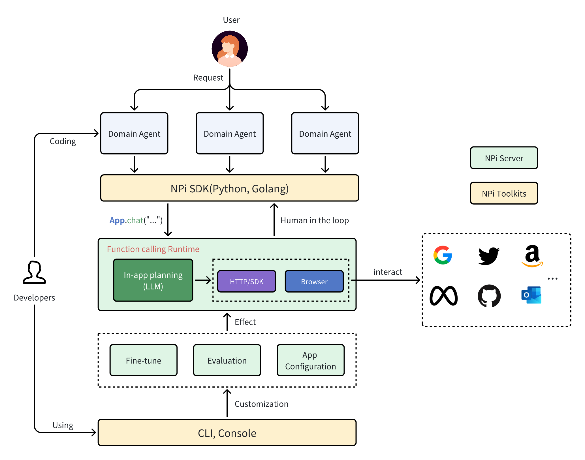

# Introducing NPi

## Background

Since ChatGPT's release, there has been a surge in AI applications designed for natural conversations. However, their
practical usefulness is often limited by a lack of automatic action-taking capabilities

The evolving concept of Agent addresses this gap. Agent AI is a class of interactive systems that can perceive visual
stimuli, language inputs, and other environmentally grounded data, and can produce meaningful embodied actions<sub>[1, Agent AI Li Fei-Fei]</sub>.

> Agents are not only going to change how everyone interacts with computers. They’re also going to upend the software
industry, bringing about the biggest revolution in computing since we went from typing commands to tapping on icons.
>
> **The future of Agents, Bill Gates**.

A major advantage humans hold over other animals is using tools. This also one of the AI Agents' key abilities is noted by Andrew Ng<sub>[3]</sub>,

However, building an AI agent with a robust ability to use tools is challenging due to the diversity of tools and the
operational overhead involved.

- Low-level primitives, such as HTTP APIs or SDKs, lead organizations to repeatedly writing similar code to integrate LLM with
different applications
- Maintaining non-business critical features, like State Management, Availability, and Authorization flows, incurs
significant overhead.
- Ensuring the security of AI Agents — making their actions controllable, predictable, and explainable — poses
substantial challenges.

Although AI agent development is progressing rapidly, we identified a significant gap in the current LLM stack ecosystem:
the absence of products specifically tailored to address the challenges of `Tool Use` faced by AI agent developers.
To fill this void, we created NPi, a platform designed to provide an easy-to-use and reliable functionalities that
enhances the robust tool-use capabilities of AI agents.

## What is NPi?

On April 25, we launched NPi (`v0.0.1`) on [GitHub](https://github.com/npi-ai/npi), a free, open-source platform.
NPi provides **Tool Use** APIs that empower AI agents to operate and interact with various software tools and applications.

The primary goal of NPi is to offer a unified interface that allows Large Language Models to seamlessly integrate with
the existing software and applications ecosystem through function calls. NPi serves as a gateway for these models to
access the virtual world.

The core principle of NPi is to focus on `in-app planning`. This requires users to break down tasks into `single-app`
sub-tasks, meaning **each task is confined to one application**. NPi then interpreters these sub-tasks into a series of
function calls, executing them in a rule-based manner to ensure precise control.

This method, known as divide-and-conquer, is a common strategy for solving complex problems and is central to NPi's designing.

To date, we have implemented the core functionalities of NPi, including:

### Out-of-box multimodal Tool use APIs

We provide ready-to-use APIs that allow large language models to interact with applications, demonstrated in the
following examples:

```python
from npiai.app.google import Calendar
from npiai.app.github import GitHub
from npiai.app.twitter import Twitter

calendar = Calendar()
calendar.chat("...")

github = GitHub()
github.chat("...")

# For non-API friendly cases, a visual-based approach leverages the web browser.
twitter = Twitter(visual=True)
twitter.chat("what's the @wellswfwang latest post?")
```

Under the hood, NPi is pre-integrated with specific applications' SDKs or APIs, interpreting the given task into a
sequence of function calls.

We continuously monitor changes in these SDKs and APIs to stay aligned with them. This ensures NPi remains up-to-date,
relieving you of the burden of tracking these changes yourself.

### Multi-agent collaboration

A clean and easy-to-use interface for building multi-agents applications.

```python
from npiai.core import Agent

agent1 = Agent(prompt="...")
agent1.use(Gmail(), Calendar())

agent2 = Agent(prompt="...")
agent2.use(GitHub())

agent3 = Agent.collaborate(agent1, agent2)
agent3.run(task="...")
```

`agent3` acts as a coordinator, orchestrating the operations of `agent1` and `agent2`.

### Human-in-the-loop(HITL)


A simple and effective way to ensure human involvement in handling sensitive operations appropriately.

> This "human in the loop" approach is an essential step in ensuring that language models behave responsibly, generate accurate responses, and align with ethical and safety standards
>
> Large Language Model: Data, Human in the Loop for Fine-Tuning, [4]


For example, in `Gmail` app, we pre-set the `sending email action` as sensitive, each calling of this action needs human
to approve sending.

```python
# These HITL APIs will be released in v0.0.2
from npiai.core.hitl import HITLRequest, HITLResponse, RequestApproved, RequestDenied, Console
from npiai_proto import api_pb2

def human_assist(req: api_pb2.HITLRequest) -> HITLResponse:
    console = Console(req) # you can integrate your own workflow
    if req.type == api_pb2.ActionType.SAFEGUARD:
        result = console.wait()
        if result.is_approved():
           return RequestApproved
    if req.action == api_pb2.ActionType.MORE_INFORMATION:
        result = console.wait()
        return result.human_message()
    return RequestDenied

gmail = Gmail()
gmail.hitl_handler(human_assist)
```

Additionally, you can easily change this behavior by providing customized configuration.

### Minimize operational overhead

Imagine developing an AI Agent to negotiate meeting times with stakeholders. Initially, the Agent proposes several time
slots and emails stakeholders for confirmation. While awaiting responses, the process not always immediate, various
low-probability issues such as unexpected shutdowns or network errors may occur.

NPi is designed to manage these states, ensuring recovery despite such disruptions, freeing developers from handling
these annoying edge cases themselves.

Beyond these, Fine-tuning, evaluation, and cost-effectiveness are also in our roadmap.

## How does NPi work?

NPi has an architecture that consists of two primary components: the **Server** and the **Toolkits**. The developers use
NPi SDKs to develop their AI Agents, and use the CLI or Web Console to customize NPi.



The Server has two main responsibilities:

- Management Functionalities: This includes App API management, authorization, and advanced options such as fine-tuning
and evaluating function calls.
- Function Calling Runtime: The server interprets tasks into a sequence of function calls based on in-app planning and
executes them. It also handles the persistence of function call states if necessary and manages communications with the
client side. This is particularly crucial for cross-agents communication and incorporating human input.

The Toolkits are a collection of tools that designed to enhance the developer experience:

- **Multi-language SDKs**:  We provide SDKs in various programming languages, making it easy for developers to integrate
NPi with their agents and enhance their tool-using capabilities.
- **CLI**: Our command-line tool offers a straightforward interface for managing apps, authorizing, and exploring NPi’s
core functionalities.
- **Web Console**: A web-based interface that enables more intricate interactions with NPi, including calling-memory
management, fine-tuning, evaluation, and observability. (Note: This feature has not been released yet.)

## What's next?

We are excited to announce the release of NPi, a platform still in its early stages, We are actively working on
implementing features that mentioned previous sections.

The mission of NPi is to act as the limbs for large language models, enabling AI Agents to interact seamlessly with
the virtual world. Although AI Agents, particularly in utilizing the Tool Use pattern, have not yet been widely adopted,
we are optimistic that NPi will accelerate this adoption and bring us closer to Artificial General Intelligence (AGI).

To realize this vision, we are eager to involve more AI Agent developers and build a vibrant community to collaboratively
shape the future of NPi.

Explore our development plans on the [NPi Roadmap](https://docs.npi.ai/roadmap). Connect with us on [GitHub](https://github.com/npi-ai/npi),
[X.com](https://x.com/npi_ai), or join our [Discord Community](https://discord.gg/MQTuXtbj). You can also reach out directly
to [our CEO](https://twitter.com/wellswfwang) via X.com.

Your support, insights, and feedback are highly valued and greatly appreciated!

We look forward to meeting you in the NPi community and exploring this exciting future together.

## Reference

1. [Agent AI: Surveying the Horizons of Multimodal Interaction, Stanford](https://arxiv.org/abs/2401.03568)
2. [The future of Agents, Bill Gates](https://www.gatesnotes.com/AI-agents)
3. [Tool use, a key design pattern of AI agentic workflowsAI Agent, Andrew Ng](https://twitter.com/AndrewYNg/status/1775951610059141147)
4. [Large Language Model: Data, Human in the Loop for Fine-Tuning](https://www.futurebeeai.com/blog/large-language-model-data-human-in-the-loop-for-fine-tuning)