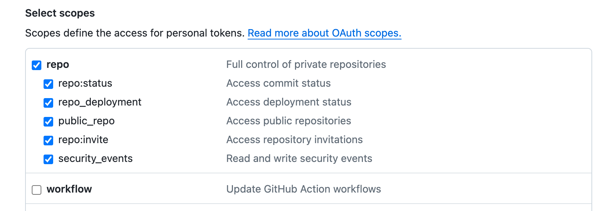

import { Callout, Steps, Tabs } from 'nextra/components';

## What is NPi?

NPi (**N**atural-language **P**rogramming **I**nterface), pronounced as **"N π"**, is an open-source platform providing **_Tool-use_** APIs to empower AI agents with the ability to operate and interact with a diverse array of software tools and applications.

## Quick Start

<Steps>

    ### Installation

    <Tabs items={['macOS', 'Linux']}>
        <Tabs.Tab>
            ```sh
            curl -O https://s.npi.ai/cli/latest/darwin/amd64/npi
            chmod +x npi
            sudo mv npi /usr/local/bin
            ```
        </Tabs.Tab>
        <Tabs.Tab>
            ```sh
            curl -O https://s.npi.ai/cli/latest/linux/amd64/npi
            chmod +x npi
            sudo mv npi /usr/local/bin
            ```
        </Tabs.Tab>
    </Tabs>

    Verify the installation by running `npi version`. If you see the output similar to the following, you are all set:

    ```json
    {
        "BuildDate": "2024-04-25_11:18:19-0500",
        "GitCommit": "708a7be",
        "Platform": "linux/amd64",
        "Version": "v0.0.1"
    }
    ```

### Setting Up NPi Server
<Callout type={'info'}>
    If Docker is not yet installed on your system, refer to the [Docker Installation Guide](https://docs.docker.com/get-docker/) for setup instructions.
</Callout>
Replace `YOUR_OAI_KEY` with your actual OpenAI API Key, then execute:

```sh
docker run -d --name npi --pull always \
    -p 9140:9140 \
    -e OPENAI_API_KEY=YOUR_OAI_KEY npiai/npi:latest
```

Confirm server connectivity by running `npi connect test`. If you receive a `server connected` message, the setup is successful. Otherwise, consult the logs with `docker logs npi` and report issues to [NPi GitHub Repository](https://github.com/npi-ai/npi/issues/new).

### Authorize NPi to Access Your GitHub Account

Generate a new token via [GitHub Tokens Page](https://github.com/settings/tokens) for NPi. You may need to grant the `repo` scope so that NPi can access repositories on behalf of you. ([Read more about scopes](https://docs.github.com/en/apps/oauth-apps/building-oauth-apps/scopes-for-oauth-apps))



Then, authorize NPi's access to your GitHub account with the following command:

```sh
npi auth github --access-token YOUR_GITHUB_ACCESS_TOKEN
```

### Support the NPi Repository

Easily star and fork the NPi Repository using:

```sh
    npi app github "what's the first PR of npi-ai/npi, include the access url, and output with json format"

    # if you like npi, star us for support
    npi app github "star npi-ai/npi"
```

### Clean up
1. Stop and remove the NPi container:
    ```sh
    docker stop npi
    docker rm npi
    ```
2. Revoke your GitHub access token by revisiting: [GitHub Tokens Page](https://github.com/settings/tokens).


</Steps>
